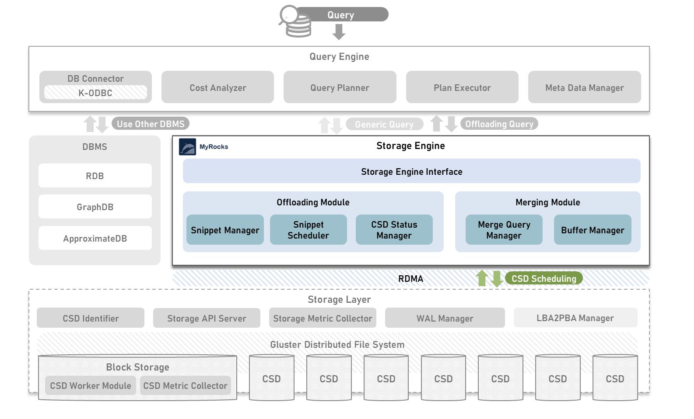

## Introduction of OpenCSD KETI-Storage-Engine-Instance
-------------

KEIT-Storage-Engine-Instance for OpenCSD Offloading Instance 

Developed by KETI



## Contents
-------------
[1. Requirement](#requirement)

[2. Required Module](#required-Module)

[3. How To Install](#How-To-Install)

[4. Modules](#modules)

[5. Governance](#governance)

## Requirement
-------------
>   Ubuntu 18.04.2 LTS

>   MySQL 5.6(Storage Engine : MyROCKS by KETI-Version)

>   RapidJSON

>   Cmake >= 3.24

>   libprotoc >= 3.19

>   gcc >= 11.04

## Required Module
- *[KETI-Query-Engine-Instance](https://github.com/opencsd/KETI-Query-Engine-Instance)*
- *[KETI-Storage-Engine-Instance](https://github.com/opencsd/KETI-Storage-Engine-Instance)*
- *[KETI-Storage-Controller-Module](https://github.com/opencsd/KETI-Storage-Controller-Module)*
- *[KETI-Block-Storage-Module](https://github.com/opencsd/KETI-Block-Storage-Module)*

## How To Install
-------------
```bash
git clone 
cd KETI-Storage-Engine-Instance/cmake/build
cmake ../..
make -j8
```

## Modules
-------------
### Storage Engine Interface
-------------
Be the first to receive and manage snippets to perform queries
#### Storage Engine Interface
-------------
Receive snippets for query execution from Query Engine Instance

### Offloading Module
-------------
Passing snippets to computational storage
#### Snippet Scheduler
-------------
Appropriate compute storage to perform query scan/filter operations is selected according to a scheduling algorithm
#### CSD Status Manager
-------------
State management of computational storage for scheduling
#### Snippet Manager
-------------
Managing snippet for offloading

### Merging Module
-------------
Merge and store work results received from computational storage
#### Merge Query Manager
-------------
Merge task results received from computational storage
#### Buffer Manager
-------------
Save merged snippet operation results and query final results


## Governance
-------------
This work was supported by Institute of Information & communications Technology Planning & Evaluation (IITP) grant funded by the Korea government(MSIT) (No.2021-0-00862, Development of DBMS storage engine technology to minimize massive data movement)

## Others
-------------
Due to the structure change, in the first half of the year, we worked on local repositories and private github.
> https://github.com/KETI-OpenCSD/Pushdown-Process-Container
